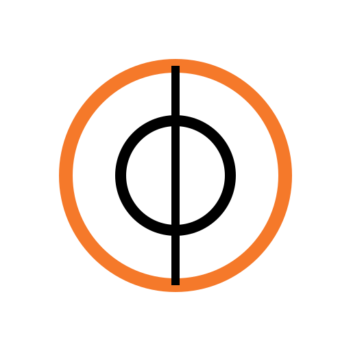

  

# BCamRemote - Mobile Camera Control Addon for Blender

Professional smartphone-to-Blender camera control at your fingertips. Transform your device into a wireless camera remote with real-time control, live viewport streaming, and precise animation recording.

---

## Overview

BCamRemote revolutionizes Blender camera workflow by enabling intuitive smartphone control. Manage multiple cameras, capture fluid animations, and preview instantly—all from your mobile device.

---

## Core Features

### Intuitive Camera Control

- **Motion-Based Orientation** - Use smartphone accelerometer + gyroscope for real-time camera rotation
- **Smooth Movement** - Physics-based inertia system for natural, controlled motion
- **Focal Distance Control** - Adjust focus distance directly from your mobile interface
- **Multi-Axis Joystick** - Full 6-DOF freedom (X, Y, Z) with precise navigation

### Live Video Streaming

- **Real-Time Viewport** - View your Blender renders directly on your phone
- **Configurable Resolutions** - SD (854x480), HD (1280x720), Full HD (1920x1080), up to 4K custom
- **Adaptive Compression** - Optimized for stable performance even on unstable connections
- **Minimal Latency** - Network streaming tuned for maximum responsiveness

### Multi-Camera Management

- **Create & Manage Multiple Cameras** - Switch seamlessly between different scene cameras
- **Auto-Selection Sync** - Real-time camera selection updates in Blender
- **Keyframe Status Indicator** - Quickly see which cameras have keyframes
- **Safe Deletion** - Confirmation dialogs prevent accidental losses

### Animation Recording

- **Precision Motion Capture** - Record every camera movement with high fidelity
- **Automatic Keyframes** - Generate keyframes from motion data automatically
- **Timeline Synchronization** - Perfect alignment with Blender timeline (configurable FPS)
- **Instant Preview** - Test animations before committing
- **Keyframe Management** - View, preview, or delete existing keyframes

### Streamlined Connection

- **Built-In QR Code** - Auto-generated code for instant connection without manual setup
- **Automatic IP Detection** - Server address configures itself
- **Robust Socket Server** - Stable bidirectional communication
- **Simple Setup** - Minimal, intuitive Blender interface

### Smart Mobile Application

- **Responsive Interface** - Optimized for all smartphone screen sizes
- **Theme Customization** - Choose colors to match your workflow
- **Inertia Control** - Adjust motion smoothing to your preference
- **Persistent Settings** - Your preferences save automatically

---

## Use Cases

### Cinematic Production
- Control camera animation during motion capture sessions
- Preview camera movements in post-production
- Synchronize multiple cameras for complex scenes

### Digital Archaeology & Virtualization
- Create interactive tours through 3D models
- Document scenes with smooth, precise movements
- Generate real-time presentation animations

### Interior & Architectural Design
- Present projects with professional camera movements
- Create dynamic flythroughs
- Explore spaces with full control

### Architectural Visualization
- Animate cameras for presentation films
- Rapidly test different angles and movements
- Coordinate multiple viewpoints for sophisticated storytelling

---

## Technical Configuration

### Requirements
- Blender 4.5 or newer
- Modern Android smartphone
- Local network (WiFi recommended)

### Installation
1. Install addon in Blender via `Preferences > Add-ons > Install`
2. Enable BCamRemote
3. Navigate to `View3D > Sidebar > BS Socket`
4. Scan the generated QR code with your phone

### Setup
- Configure host and port for your network
- Select the Blender camera to control
- Choose your preferred streaming resolution

---

## Key Advantages

| Feature | Benefit |
|---------|---------|
| Real-Time Control | Instant feedback on every movement |
| Multi-Camera Support | Manage multiple cameras effortlessly |
| Recording System | Precise animation capture |
| Wireless Operation | Complete mobility in your workspace |
| User-Friendly | Intuitive interface for all skill levels |
| High Performance | Optimized for maximum fluidity |

---

## Why BCamRemote?

BCamRemote bridges physical control with digital precision. Whether you're an animator, architect, filmmaker, or 3D creator seeking an efficient and natural way to control Blender cameras, BCamRemote delivers an immersive, intuitive experience.

Transform your animation workflow into something truly interactive and responsive.

**BCamRemote** - *Your smartphone, your creative remote control.*
